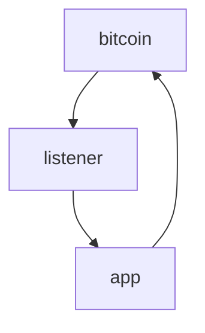

## Jungle Bus Listener

Listen to the bitcoinsv blockchain and emit events to your app.

1. Create a [JungleBus](https://junglebus.gorillapool.io/) account
1. Setup Subscriptions in JungleBus to listen to filtered events
1. Specify a `JUNGLE_BUS_SUBSCRIPTION_ID` in `.env`
1. Push this repository to [Heroku](https://heroku.com) or [Fly.io](https://fly.io), as a Node.js application.

When the app starts up, it will tune into the subscription,
then begin receiving events. Each event has a callback,
and you can define, in code, how to process each event.

For example, you can parse a transaction (TX), its inputs and outputs, and forward the transactions
and/or other data to another application via HTTP POST.
